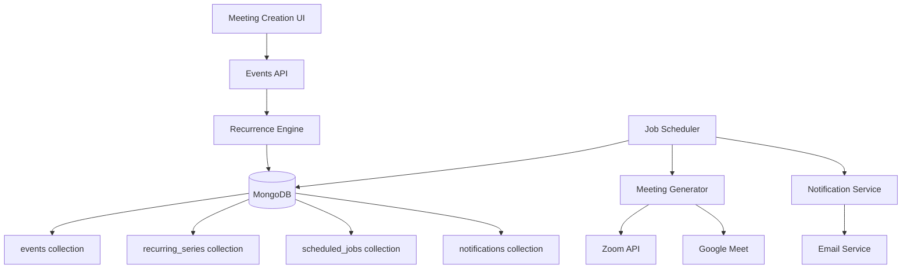

# Design Document

## Overview

The recurring meetings feature extends the existing meeting system with automated scheduling capabilities. The design leverages the current Next.js architecture, MongoDB database, and email infrastructure while adding new components for recurrence pattern management, background job processing, and automated notification scheduling.

The system will use a job scheduler approach with MongoDB-based job queues to ensure reliability and scalability. Each recurring meeting series will generate individual meeting instances that integrate seamlessly with existing Zoom and Google Meet functionality.

## Architecture

### High-Level Architecture



### Data Flow

1. **Creation Flow**: User creates recurring meeting → Recurrence engine validates pattern → Series record created → Initial jobs scheduled
2. **Generation Flow**: Job scheduler triggers → Meeting generator creates instances → Zoom/Google Meet APIs called → Database updated
3. **Notification Flow**: Notification scheduler triggers → Email service sends reminders → Tracking data recorded

### Database Schema Extensions

The design extends the existing MongoDB collections and adds new ones:

**New Collections:**
- `recurring_series` - Stores recurrence patterns and series metadata
- `scheduled_jobs` - Job queue for background processing
- `notifications` - Notification scheduling and tracking

**Extended Collections:**
- `events` - Add `seriesId` and `recurrenceInstance` fields

## Components and Interfaces

### 1. Recurrence Pattern Engine

**Location**: `src/lib/recurrence.js`

**Purpose**: Handles recurrence pattern validation, calculation, and instance generation.

**Key Functions**:
```javascript
// Validates recurrence pattern
validateRecurrencePattern(pattern)

// Generates next N occurrences
generateOccurrences(pattern, startDate, count)

// Calculates next occurrence date
getNextOccurrence(pattern, fromDate)

// Handles pattern modifications
updateRecurrencePattern(seriesId, newPattern, applyFrom)
```

**Recurrence Pattern Structure**:
```javascript
{
  type: 'daily' | 'weekly' | 'monthly' | 'custom',
  interval: number, // Every N days/weeks/months
  daysOfWeek: [0,1,2,3,4,5,6], // For weekly (0=Sunday)
  dayOfMonth: number, // For monthly (1-31)
  weekOfMonth: number, // For monthly (1-4, -1=last)
  endCondition: {
    type: 'date' | 'count' | 'never',
    endDate: Date,
    occurrenceCount: number
  }
}
```

### 2. Job Scheduler Service

**Location**: `src/lib/scheduler.js`

**Purpose**: Background job processing for meeting generation and notifications.

**Key Functions**:
```javascript
// Initialize scheduler on app startup
initializeScheduler()

// Schedule a new job
scheduleJob(type, payload, executeAt)

// Process pending jobs
processJobs()

// Handle job failures and retries
handleJobFailure(jobId, error)
```

**Job Types**:
- `generate_meeting` - Create meeting instances
- `send_reminder` - Send notification reminders
- `cleanup_past_meetings` - Archive old meetings

### 3. Meeting Generator Service

**Location**: `src/lib/meetingGenerator.js`

**Purpose**: Creates individual meeting instances from recurring series.

**Key Functions**:
```javascript
// Generate meeting instances for a series
generateMeetingInstances(seriesId, fromDate, toDate)

// Create single meeting instance
createMeetingInstance(seriesData, occurrenceDate)

// Handle provider-specific meeting creation
createProviderMeeting(meetingData, provider)
```

### 4. Notification Scheduler

**Location**: `src/lib/notificationScheduler.js`

**Purpose**: Manages automated reminder notifications and series notifications.

**Key Functions**:
```javascript
// Schedule reminders for a meeting
scheduleReminders(meetingId, reminderSettings)

// Send reminder notification
sendReminder(notificationId)

// Send series notification email
sendSeriesNotification(seriesId, participants)

// Handle notification failures
handleNotificationFailure(notificationId, error)
```

### 5. Enhanced Events API

**Location**: `src/app/api/events/route.js` (extended)

**New Endpoints**:
- `POST /api/events/recurring` - Create recurring series
- `PUT /api/events/recurring/[seriesId]` - Update series
- `DELETE /api/events/recurring/[seriesId]` - Delete series
- `GET /api/events/recurring/[seriesId]/instances` - Get series instances
- `POST /api/events/recurring/[seriesId]/notify` - Send series notification

### 6. Recurring Meeting UI Components

**Location**: `src/components/recurring/`

**Components**:
- `RecurrencePatternSelector` - UI for selecting recurrence patterns
- `RecurringMeetingManager` - Manage existing recurring series
- `InstanceEditor` - Edit individual occurrences
- `ReminderSettings` - Configure notification timing
- `SeriesNotificationSettings` - Configure series notification options

### 7. Enhanced Email Service

**Location**: `src/lib/email.js` (extended)

**New Email Templates**:
- `sendSeriesNotificationEmail()` - Series announcement email
- `sendSeriesUpdateEmail()` - Series modification notification

**Series Notification Email Features**:
- Clear series overview with recurrence pattern
- Next 5-10 upcoming meeting dates
- Calendar file with all series meetings
- Unsubscribe/modify participation options
- Visual timeline of meeting schedule

## Data Models

### Recurring Series Model

```javascript
{
  _id: ObjectId,
  title: String,
  description: String,
  host: String,
  hostId: String,
  
  // Recurrence Configuration
  recurrencePattern: {
    type: String, // 'daily', 'weekly', 'monthly', 'custom'
    interval: Number,
    daysOfWeek: [Number],
    dayOfMonth: Number,
    weekOfMonth: Number,
    endCondition: {
      type: String, // 'date', 'count', 'never'
      endDate: Date,
      occurrenceCount: Number
    }
  },
  
  // Meeting Configuration
  duration: Number,
  participants: [String],
  provider: String, // 'zoom', 'google_meet'
  zoomSettings: Object,
  joinUrl: String, // For Google Meet
  
  // Notification Configuration
  reminderSettings: [{
    timing: Number, // Minutes before meeting
    enabled: Boolean
  }],
  seriesNotification: {
    enabled: Boolean,
    sent: Boolean,
    sentAt: Date
  },
  
  // Tracking Configuration
  trackOpens: Boolean,
  trackClicks: Boolean,
  trackAck: Boolean,
  useInterstitialJoin: Boolean,
  redirectDelay: Number,
  includeDirectMeetingLink: Boolean,
  
  // Series Metadata
  createdAt: Date,
  updatedAt: Date,
  isActive: Boolean,
  nextGenerationDate: Date, // When to generate next batch
  lastGeneratedUntil: Date, // Last date instances were generated
  
  // Statistics
  totalInstances: Number,
  completedInstances: Number,
  cancelledInstances: Number
}
```

### Extended Event Model

```javascript
{
  // Existing fields...
  
  // New fields for recurring meetings
  seriesId: ObjectId, // Reference to recurring_series
  recurrenceInstance: {
    originalDate: Date, // Original scheduled date
    isModified: Boolean, // If this instance was modified
    isCancelled: Boolean, // If this instance was cancelled
    modificationReason: String
  },
  
  // Instance-specific overrides
  overrides: {
    title: String,
    description: String,
    participants: [String],
    duration: Number
  }
}
```

### Scheduled Job Model

```javascript
{
  _id: ObjectId,
  type: String, // 'generate_meeting', 'send_reminder', 'cleanup'
  status: String, // 'pending', 'processing', 'completed', 'failed'
  
  payload: {
    seriesId: ObjectId,
    meetingId: ObjectId,
    notificationId: ObjectId,
    // Other job-specific data
  },
  
  scheduling: {
    executeAt: Date,
    createdAt: Date,
    startedAt: Date,
    completedAt: Date,
    retryCount: Number,
    maxRetries: Number
  },
  
  error: {
    message: String,
    stack: String,
    lastFailedAt: Date
  }
}
```

### Notification Model

```javascript
{
  _id: ObjectId,
  meetingId: ObjectId,
  seriesId: ObjectId,
  
  recipient: String, // Email address
  type: String, // 'reminder', 'cancellation', 'update', 'series_notification'
  timing: Number, // Minutes before meeting (null for series notifications)
  
  status: String, // 'scheduled', 'sent', 'failed', 'cancelled'
  scheduledFor: Date,
  sentAt: Date,
  
  // Series notification specific data
  seriesData: {
    upcomingMeetings: [Date], // Next few meeting dates
    totalMeetings: Number, // Total expected meetings
    recurrenceDescription: String // Human readable pattern
  },
  
  tracking: {
    token: String,
    opened: Boolean,
    openedAt: Date,
    clicked: Boolean,
    clickedAt: Date,
    acknowledged: Boolean,
    acknowledgedAt: Date
  },
  
  error: {
    message: String,
    retryCount: Number,
    lastFailedAt: Date
  }
}
```

## Error Handling

### Graceful Degradation Strategy

1. **Zoom API Failures**: Fallback to manual meeting creation with notification to organizer
2. **Email Delivery Failures**: Implement exponential backoff retry with dead letter queue
3. **Database Failures**: Transaction rollback with job rescheduling
4. **Recurrence Calculation Errors**: Skip problematic instances with admin notification

### Error Recovery Mechanisms

```javascript
// Retry configuration
const RETRY_CONFIG = {
  zoom_api: { maxRetries: 3, backoffMs: [1000, 5000, 15000] },
  email_send: { maxRetries: 5, backoffMs: [2000, 10000, 30000, 60000, 300000] },
  job_processing: { maxRetries: 3, backoffMs: [5000, 30000, 120000] }
};

// Dead letter queue for failed jobs
const handleFailedJob = async (job, error) => {
  if (job.retryCount >= job.maxRetries) {
    await moveToDeadLetterQueue(job, error);
    await notifyAdministrator(job, error);
  } else {
    await scheduleRetry(job, RETRY_CONFIG[job.type].backoffMs[job.retryCount]);
  }
};
```

## Testing Strategy

### Unit Testing

**Test Coverage Areas**:
- Recurrence pattern validation and calculation
- Meeting instance generation logic
- Notification scheduling algorithms
- Error handling and retry mechanisms

**Key Test Cases**:
```javascript
describe('Recurrence Engine', () => {
  test('generates correct weekly occurrences');
  test('handles month-end edge cases');
  test('respects end conditions');
  test('validates invalid patterns');
});

describe('Job Scheduler', () => {
  test('processes jobs in correct order');
  test('handles concurrent job execution');
  test('implements retry logic correctly');
});
```

### Integration Testing

**Test Scenarios**:
- End-to-end recurring meeting creation
- Zoom/Google Meet API integration
- Email delivery and tracking
- Database transaction integrity

### Performance Testing

**Load Testing Targets**:
- 1000+ concurrent recurring series
- 10,000+ meeting instances per day
- Email delivery rate of 100+ per minute
- Job processing latency under 5 seconds

## Security Considerations

### Data Protection

1. **Encryption**: Sensitive meeting data encrypted at rest
2. **Access Control**: Role-based permissions for recurring meeting management
3. **Audit Logging**: Track all modifications to recurring series
4. **Token Security**: Secure generation and validation of tracking tokens

### API Security

```javascript
// Rate limiting for recurring meeting creation
const RATE_LIMITS = {
  create_recurring: { requests: 10, window: '1h' },
  update_series: { requests: 50, window: '1h' },
  generate_instances: { requests: 100, window: '1h' }
};

// Input validation
const validateRecurrenceInput = (data) => {
  // Sanitize and validate all input fields
  // Prevent injection attacks
  // Validate date ranges and limits
};
```

### Privacy Compliance

- **Data Retention**: Automatic cleanup of old meeting data
- **Consent Management**: Track participant consent for notifications
- **Data Export**: Provide data export functionality for compliance

## Performance Optimization

### Database Optimization

```javascript
// Indexes for efficient querying
db.recurring_series.createIndex({ "nextGenerationDate": 1, "isActive": 1 });
db.scheduled_jobs.createIndex({ "executeAt": 1, "status": 1 });
db.events.createIndex({ "seriesId": 1, "startTime": 1 });
db.notifications.createIndex({ "scheduledFor": 1, "status": 1 });
```

### Caching Strategy

- **Redis Cache**: Cache frequently accessed series data
- **Memory Cache**: Cache recurrence calculations
- **CDN**: Cache static assets for UI components

### Background Processing

```javascript
// Batch processing configuration
const BATCH_CONFIG = {
  meeting_generation: { batchSize: 50, intervalMs: 30000 },
  notification_sending: { batchSize: 100, intervalMs: 10000 },
  cleanup_jobs: { batchSize: 200, intervalMs: 300000 }
};
```

## Monitoring and Observability

### Metrics Collection

```javascript
// Key metrics to track
const METRICS = {
  recurring_series_created: 'counter',
  meeting_instances_generated: 'counter',
  notifications_sent: 'counter',
  job_processing_duration: 'histogram',
  api_response_time: 'histogram',
  error_rate: 'gauge'
};
```

### Health Checks

- **Job Scheduler Health**: Monitor job processing lag
- **Database Health**: Track connection pool and query performance
- **External API Health**: Monitor Zoom/Google Meet API availability
- **Email Service Health**: Track delivery rates and bounce rates

### Alerting

```javascript
// Alert conditions
const ALERTS = {
  job_processing_lag: { threshold: '5m', severity: 'warning' },
  high_error_rate: { threshold: '5%', severity: 'critical' },
  email_delivery_failure: { threshold: '10%', severity: 'warning' },
  api_response_time: { threshold: '2s', severity: 'warning' }
};
```